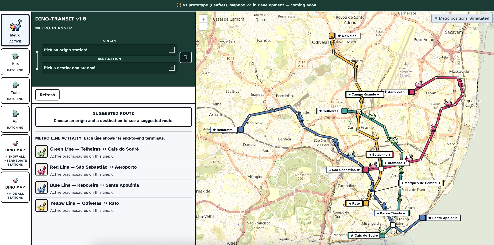
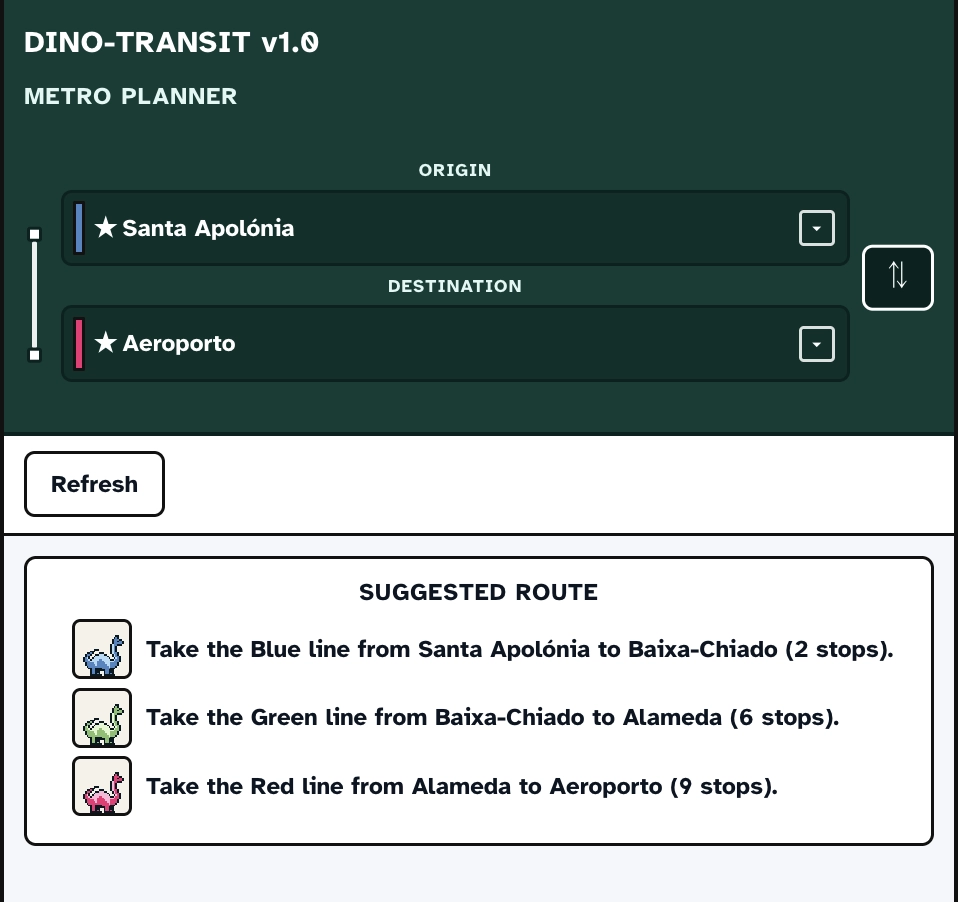
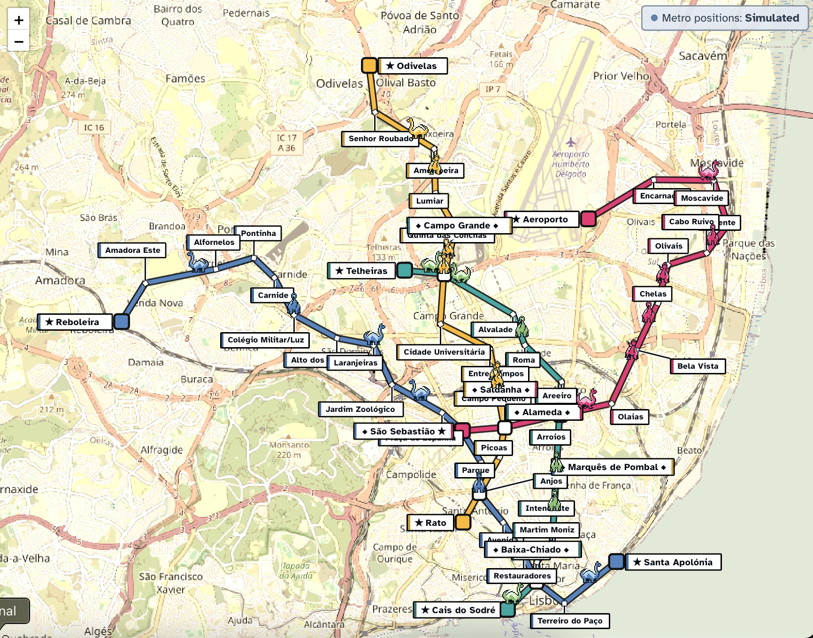

# Dino Transit — Prehistoric Real-Time Mobility

*"v1 is frozen as-shipped; v2 is planning."*

An accessibility-aware **full-stack** Lisbon **transit** tracker on a **Leaflet** map with **Game Boy–style** dinosaur sprites. **Spring Boot** can pull from a **simulator**, the **Metro Lisboa** API, **GTFS-RT**, or **GTFS schedule**, reshapes everything into one model, then streams updates over **WebSockets**. **React** paints positions, line color, and a small "what feed?" badge—same deal as my other projects: **the server owns the truth; the map only shows it.**

**🔗 [Live demo (Render)](https://dino-transit-frontend.onrender.com/)**

> **Deployment note:** Free-tier **Render**; expect **cold starts** after the app idles for a while. **No login.** The runnable project lives under **`v1-leaflet/`**. The banner mentions **Mapbox v2**, but **that rework is not in this repo yet.**

---

## How to Explore Dino Transit (v1)

The demo defaults to a **simulator** (smooth trains, **no API keys**). Everything on the map—including **planner** line activity—rides the **same** live batch from the backend.

1. **Land on the map** — four lines, **brachiosaurus** sprites, station **labels**. Use **DINO MAP** if you want fewer labels or only non-terminal stops (preferences stick in the browser).

2. **Try the sidebar planner** — pick start and end stations; routing picks the **fewest hops** across the metro graph. You'll see which lines belong on that trip.

3. **Peek at other modes** — footer tabs: **Metro** really runs; **Bus / Train / Air** only show planner "eggs" (real Carris / CP / flights were never wired).

Screenshots: [`v1-leaflet/docs/`](v1-leaflet/docs/).








**💡 Exploration tip:** The **simulator** feels smooth because the timing is scripted. **Metro Lisboa** mode only gets **waiting times and stop lists**, not live GPS, so the backend has to **guess where trains are** along the line. **Trains** look jumpy on purpose: **"live" data is not the same as movie-smooth motion.**

---

## Project Background

This project began as a junior-portfolio idea born from wanting to understand how mobility platforms actually work—not just the pretty map, but the pipes underneath. I envisioned an all-encompassing transit app for Lisbon that would scale from the metro to buses, trains, and eventually airplanes. Technically, I wanted **vehicles and timing to come from the server**, not from vague JavaScript hacks in the browser alone. **Leaflet** worked for v1 because it was dependable while I chased APIs, timetable files, and messy labels.

### Where the plan met reality

Once I had the simulator humming and the sprites gliding along their routes—smooth, scripted, beautiful—I was excited to plug in the **actual** Lisbon Metro API. I created an account on the [developer portal](https://api.metrolisboa.pt/store/apis), wired up the only available endpoint (**EstadoServicoML 1.0.1**, last updated October 2019), and... watched my perfect sprite animations shatter. What I hadn't realized—naively—was that the API only provides **waiting times and stop lists**, not the real-time GPS traces I assumed existed. You simply cannot get smooth, GPS-like movement out of data that only tells you "a train is _somewhere_ between these two stations." Metropolitano de Lisboa does not provide GTFS data, and that gap was something I never planned for.

The sprite motion I'd poured time into suddenly looked broken, and I found myself asking, "what happened to my beautiful animations?" The answer was straightforward: **I was never going to get silky-smooth movement from an API that doesn't know where individual metro trains are.** That realization reshaped the entire project.

**Leaflet** brought its own surprises. For the label system I had in mind, I couldn't force station labels to anchor at a specific pixel offset on the map—Leaflet simply wouldn't let me. After enough fighting, I settled on **visibility toggles** as a stable compromise so labels stay legible at any zoom without overlapping each other.

Rather than discard the work, I split the project into two iterations: **v1** remains a testament to my initial learning curve and the obstacles I navigated; **v2** is being planned with a refined set of knowledge and a more robust technical foundation. I genuinely wanted to innovate and build a mobility app with accessibility in mind from the start, but my lack of knowledge and insufficient planning at the time led me to v1's limits—and honestly, that's the most useful thing this project taught me.

### 🦕 The "Retro Hook"

Think chunky **Game Boy Color** aesthetics plus ***Jurassic Park*** vibes. **Metro** rides with **Brachiosaurus** sprites today. Other vehicles were planned as **Triceratops** buses, **Ankylosaurus / Stegosaurus** trains, and **Quetzalcoatlus** airplanes, but no sprites were prepared/developed for those — hatching egg GIFs stand in as "coming soon" placeholders in the planner instead.

### 📊 Transit Data

- **Simulator** — the simplest story: scripted loops along the geometry the map already trusts. `JurassicRailService` nudges 24 dinosaurs (six per line) along real Lisbon Metro coordinates every tick.

- **Metro Lisboa ([developer portal](https://api.metrolisboa.pt/store/apis))** — OAuth unlocks waits, line status pings, stops—everything **except** GPS traces locked to individual trains. **Between stations**, Spring guesses coordinates. **Simulator mode alone** stays silky smooth.

- **GTFS bundles, realtime feeds, and schedule-only mode** — you only get whatever quality you plugged into config.

- **When realtime flakes**, Spring walks **cached snapshot → schedule guess → simulator** so dinosaurs never silently vanish.

### 🎨 Design & Accessibility

**Aesthetic:** The UI riffs on schematic transit maps—**◆** for transfers, **★** for terminals, tinted rails beside the text. All body text rides **Atkinson Hyperlegible** for maximum readability; sprites are **itch.io** assets recolored to match official Lisbon Metro palettes.

**Accessibility:** I prioritized building inclusive habits from the start. That meant high-contrast tokens, **44×44** interactive targets where it matters, visible **`:focus-visible`** affordances, **`prefers-reduced-motion`** respected globally, `useLayoutEffect` for focus management to prevent screen-reader ghosting, and a `LiveAnnouncer` component that pushes status updates to an ARIA live region—not waving a laminated WCAG score, but the instincts match sibling apps and I'm still tightening as I learn.

## Assets & Credits

**Sprites:** Brachiosaurus (recolored by line) from [teaceratops · Dinosaur Sprites for GB Studio](https://teaceratops.itch.io/dinosgbs); planner egg from [Annivilus · Pet Egg](https://annivilus.itch.io/pet-eggs). Line colors approximate official Lisbon Metro hues.

---

## Architecture & Tech Stack

**Docker Compose** under **`v1-leaflet/`** ties Spring Boot to an nginx-hosted React bundle. The SPA opens **STOMP** on **`/ws`**, subscribes to **`/topic/transport`**, and nginx ships the compiled assets. `RealTimeService` broadcasts on a configurable timer (default **500 ms**), `ConfiguredTransportUpdateSource` picks the active mode and runs the fallback ladder, and React never pretends it's simulating physics for whole trains.

| Layer | Stack |
| :--- | :--- |
| **Backend** | Java 21, Spring Boot 4.0.2, STOMP/WebSocket, GTFS realtime bindings |
| **Frontend** | React 19, Vite 7, Leaflet 1.9, react-leaflet 5, `@stomp/stompjs`, CSS Modules |
| **Ops** | Docker Compose (`dino-transit-v1`) |

**Repo layout:** **`v1-leaflet/`** is what runs today; **`v2-mapbox/`** is only an empty placeholder until a real v2 exists.

---

## Features & Roadmap

No design-prototype phase—UI and UX decisions hardened while I built.

### Metro & Map (v1)

| Status | Feature |
| :---: | :--- |
| ✅ | Four-line Leaflet map, dinosaur sprites, DINO MAP label modes |
| ✅ | STOMP stream (`/topic/transport`) driving positions + data-source badge |
| ✅ | Sidebar planner (BFS shortest path) wired to the same update batch |
| ✅ | Backend modes: `simulator` (default), `metrolisboa`, `gtfs`, `schedule` with configurable fallbacks |

### Up Next (v2)

| Status | Area |
| :---: | :--- |
| 🚧 | **Accessibility** — keep tightening keyboard routes and screen-reader coverage; formal audits are still a growth edge |
| ⏳ | **Testing** — not implemented yet; next stretch is JUnit for backend services and Vitest + jest-axe for frontend components as I build confidence |
| ⏳ | **v2** — the **`v2-mapbox/`** folder is an empty stub. **Rough notes—not promises:** perhaps **Mapbox**, **Kotlin**, new **hosting**, or feeds from somewhere like **Porto**. Until then, treat **v1** as how Spring Boot and React already agree |

---

## 🏃‍♂️ Getting Started

All runnable code is under **`v1-leaflet/`**.

### Option A: Docker (recommended)

**Docker Desktop** (or your preferred engine) is enough.

```bash
cd v1-leaflet && docker compose up --build
```

If your install still has the older binary, use `docker-compose up --build`.

| Service | URL / port |
| :--- | :--- |
| Frontend (nginx) | http://localhost:5500 |
| Backend (API + WebSocket) | http://localhost:8181 (WS path `/ws` baked into the Compose build) |

### Option B: Manual (for development)

**Java 21**, **`./mvnw`**, **Node 20+**.

**1. Backend**

```bash
cd v1-leaflet/backend && ./mvnw spring-boot:run
```

Default **`TRANSIT_MODE`** is **`simulator`** (port **8080** unless you override **`PORT`**).

**2. Frontend**

```bash
cd v1-leaflet/frontend && npm install && npm run dev
```

| Service | URL |
| :--- | :--- |
| Vite dev server | http://localhost:5500 |
| Backend | http://localhost:8080 |

Point the SPA at the right broker when ports differ, e.g. `VITE_WS_URL=ws://localhost:8181/ws npm run dev`.

**Metro Lisboa** secrets never belong in the browser. **Configure them only on the server**—see [`application.properties`](v1-leaflet/backend/src/main/resources/application.properties) plus the Metro developer portal for OAuth values.

---

> **Built with the mindset that even when the real-world API can't deliver what you assumed, the server still tells the story—and the map just listens.**
>
> *Thanks for checking out Dino Transit! While it was fun and frustrating, this project taught me more about planning than about trains. ◕⩊◕*

---
