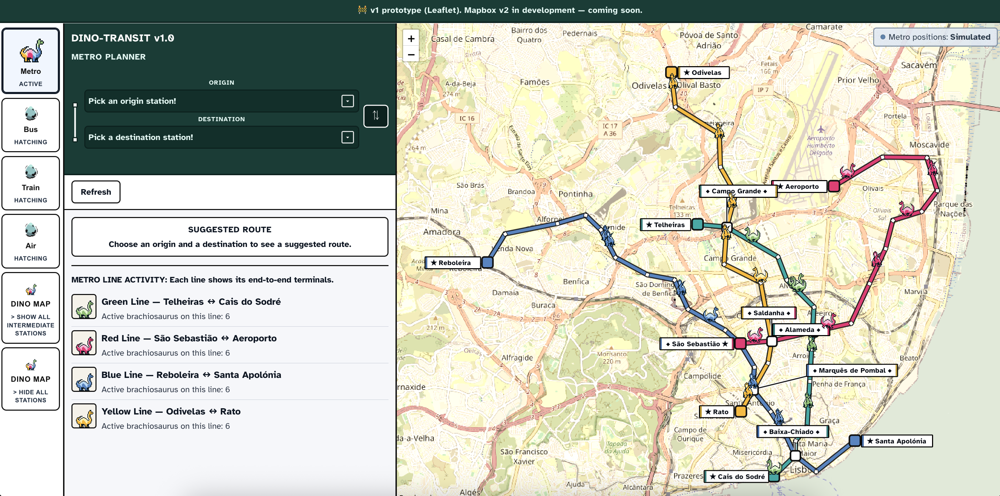
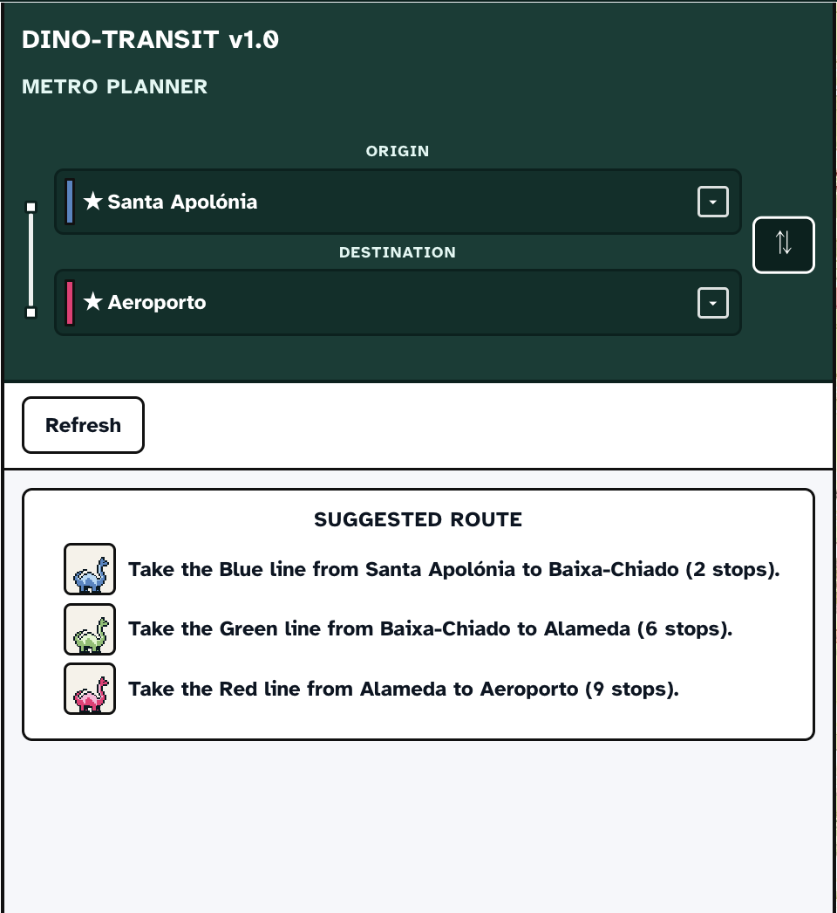
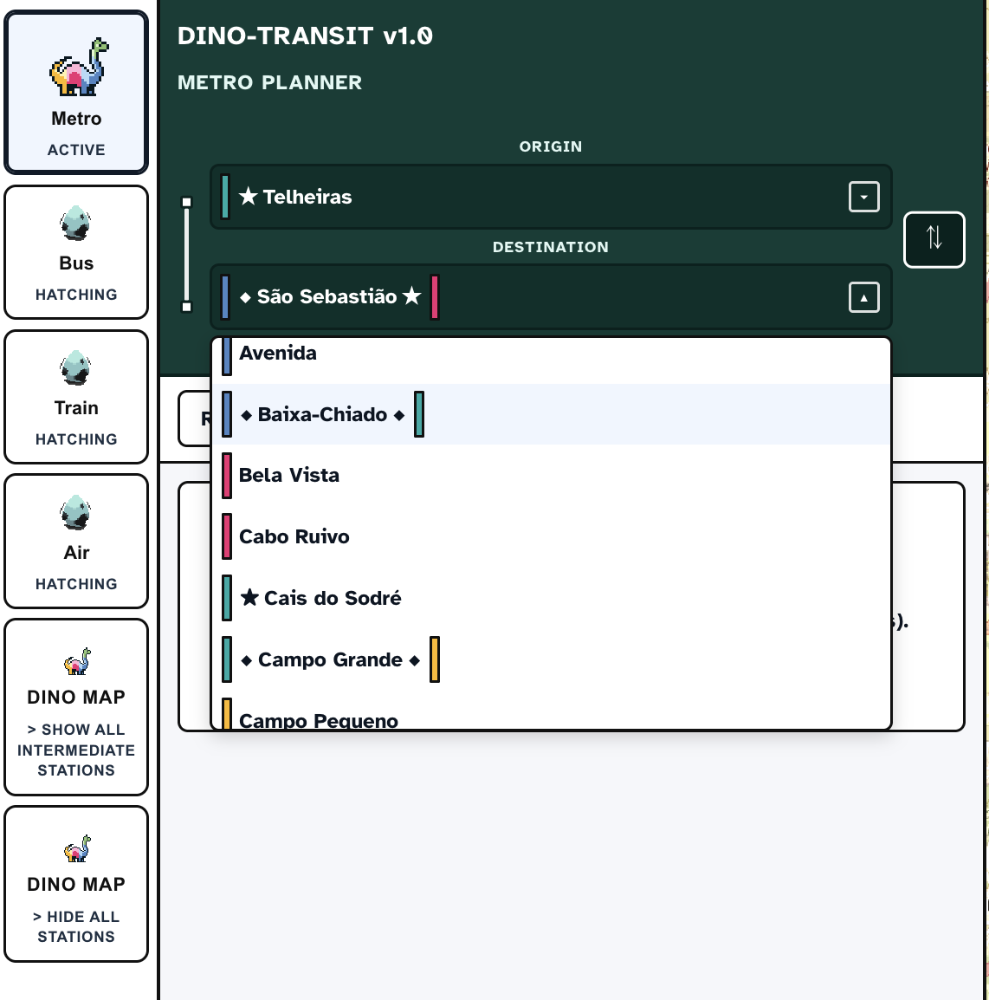
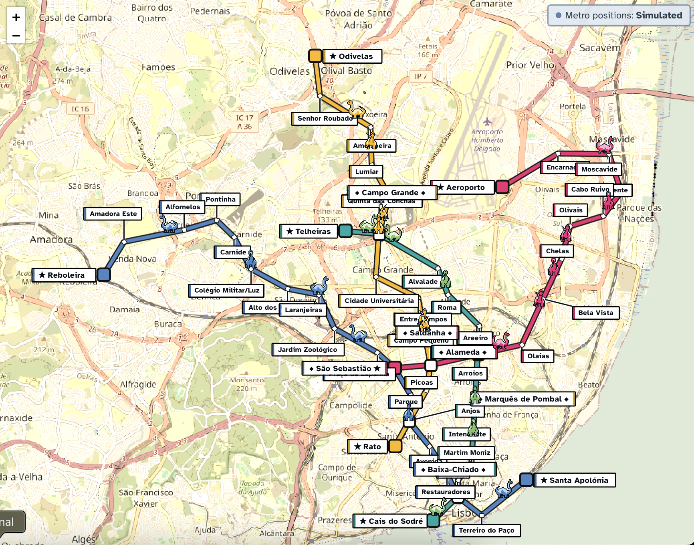
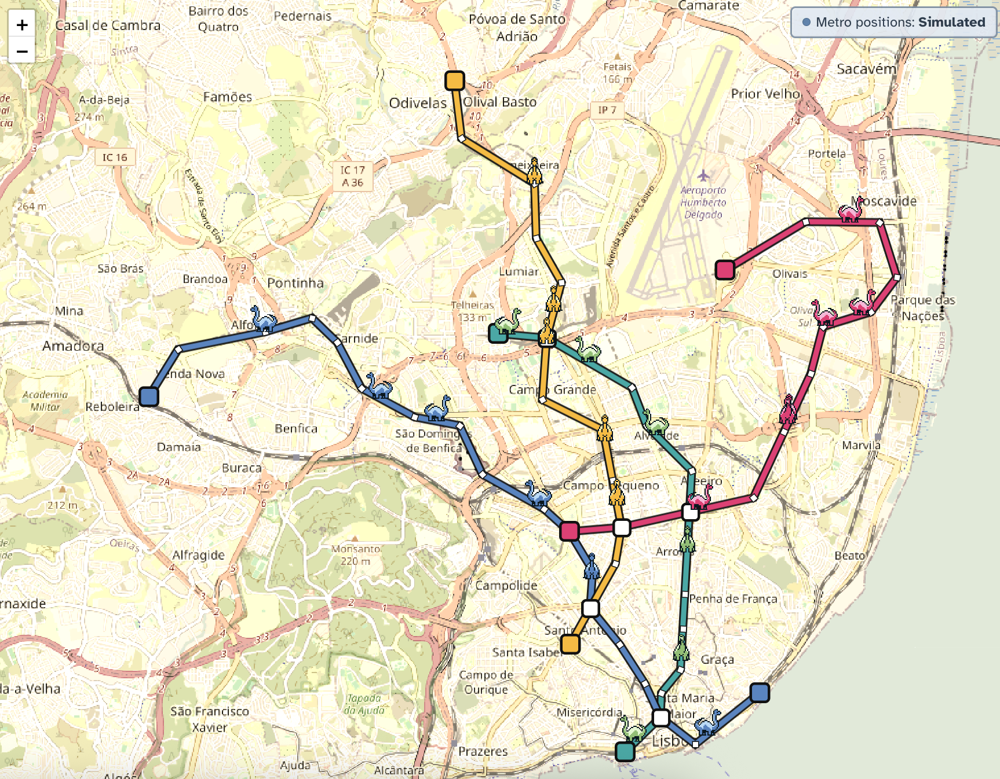
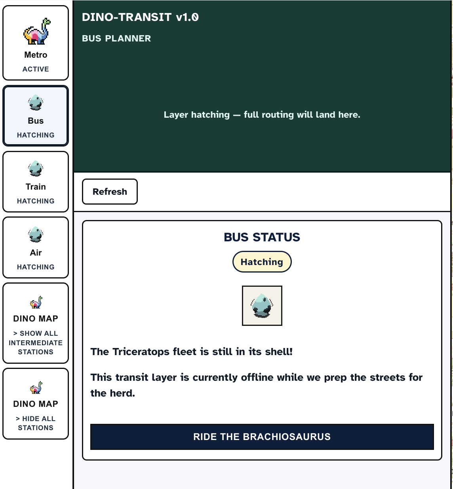

# Dino Transit: Prehistoric Real-Time Mobility — v1.0

**A real-time-style digital twin of Lisbon public transport, shown as Game Boy–inspired dinosaurs on a map.**

The idea is to blend Lisbon public transport with a retro pixel look and live updates from the backend. Spring Boot pushes vehicle positions over WebSockets; the React + Leaflet frontend draws lines, stations, and animated sprites.

**Multimodal roadmap:** Over time, I want this app to cover **metro, bus, train, and air**. Metro is the first slice in v1. **By default** the backend runs the **simulator** so the Leaflet map shows smooth motion; Metro Lisboa, GTFS-Realtime, and schedule-style feeds are optional and switched with `TRANSIT_MODE` (see matrix below). **Bus** (Carris), **Train** (CP), and **Air** are **WIP stubs** in the UI (no live data yet). I also hope to add a proper **logo or wordmark** for Dino Transit and a **short intro animation** the first time someone visits—nothing built for that yet.

I'm still figuring a lot of this out—especially how far to push **WCAG 2.2 AAA** (contrast, focus, screen reader wording) while keeping the Game Boy–ish vibe. The repo includes accessibility notes I treat as a north star, not a finished audit (see **Design and accessibility (v1 status)** below).

## Why v1 stays Leaflet, and v2 is separate

**Version 1** stays on **Leaflet** on purpose: it is the **stable, shippable prototype** this repo documents—WebSockets and `TransportUpdate` on the backend, and a map stack that was fast to iterate for diagram-style stations, the planner, and accessibility work. That choice comes with **honest limits** (labels tied to geographic anchors, basemap styling, and interaction patterns that are harder to push toward a “finished” transit product purely in Leaflet). **Version 2** is a **separate map-layer effort** built around **Mapbox** so richer cartography and UX can advance **without** breaking the **Render** v1 demo or turning this branch into a risky big-bang rewrite. Until v2 ships publicly, treat **v1 as the reference implementation** for behavior and APIs described here.



## v1 prototype and v2

This repository **is** the v1 stack: **Leaflet** in the browser and **Spring Boot** feeding updates over WebSockets. The **Render** deployment is the same product line as this code and includes a fixed top banner about **Mapbox v2** (in development).

**Why simulator is the default:** every mode normalizes to the same `TransportUpdate` JSON, but the **physics are not interchangeable** — the simulator advances along known geometry every tick; the Metro Lisboa API exposes **wait times at platforms** (positions are inferred on the server); GTFS-RT gives **sparse vehicle positions**; schedule mode walks **timetables** when static GTFS is available. Smooth, film-like motion is honest only in simulator mode, which is why it is the postcard default for v1.

### Backend transit modes (environment matrix)

Switch modes by setting `TRANSIT_MODE` (and the variables in each row) before `cd backend && ./mvnw spring-boot:run`. Run **one local smoke test per row** before you tag a release: confirm `/topic/transport` returns a non-empty batch where noted.


| `TRANSIT_MODE`              | Minimum extra configuration                                                                                | Typical `source` in JSON                           | What you should see                                                                                                                                                  |
| --------------------------- | ---------------------------------------------------------------------------------------------------------- | -------------------------------------------------- | -------------------------------------------------------------------------------------------------------------------------------------------------------------------- |
| `simulator` *(default)*     | none                                                                                                       | `simulated`                                        | Smooth metro trains on all four lines without API keys.                                                                                                              |
| `metrolisboa`               | `TRANSIT_METROLISBOA_ENABLED=true` plus OAuth or token env vars (see block below).                         | `live` (or `cached` if fallback serves stale data) | Wait-time–driven positions; **not** GPS from the operator.                                                                                                           |
| `gtfs`                      | `TRANSIT_GTFS_ENABLED=true`, `TRANSIT_GTFS_STATIC_PATH`, vehicle positions URL, optional trip updates URL. | `live`                                             | Real vehicle feed mapped through static GTFS IDs. **Note:** the UI badge still says “Live” for Metro API mode too — distinguish by which `TRANSIT_MODE` you started. |
| `schedule`                  | `TRANSIT_GTFS_STATIC_PATH` pointing at an extracted GTFS bundle.                                           | `schedule`                                         | Timetable interpolation at “now” in Europe/Lisbon. **Empty list is normal** if no static bundle is configured.                                                       |


Metro Lisboa example (credentials never go in the frontend):

```bash
TRANSIT_MODE=metrolisboa \
TRANSIT_METROLISBOA_ENABLED=true \
METROLISBOA_BASE_URL=https://api.metrolisboa.pt:8243/estadoServicoML/1.0.1 \
METROLISBOA_TOKEN_URL=https://api.metrolisboa.pt:8243/token \
METROLISBOA_CLIENT_ID=your_consumer_key \
METROLISBOA_CLIENT_SECRET=your_consumer_secret \
./mvnw spring-boot:run
```

Simulator explicit (same as default):

```bash
TRANSIT_MODE=simulator ./mvnw spring-boot:run
```

## Live demo (v1)

The **public v1 frontend** is deployed on [Render](https://render.com):

**[https://dino-transit-frontend.onrender.com/](https://dino-transit-frontend.onrender.com/)**

That URL is the **Leaflet + React** client described in this README. The **backend** is also deployed on Render (separate service); the browser loads updates over **STOMP/WebSocket** on `/topic/transport`. Production builds bake in the broker URL via `VITE_WS_URL` (see [`frontend/README.md`](frontend/README.md)). Treat that deployment as the **same v1 prototype** as this repository, not a separate product line.

## Screenshots (v1)

### Trip planner with a computed route

Metro minimum-stop routing (Santa Apolónia → Aeroporto) with live line activity in the sidebar.



### Metro station picker (open list)

Origin or destination combobox with diagram-style line rails and interchange/terminal glyphs (same label model as the map).



### Station labels on the map

All station labels visible (diagram-style badges and leaders on the basemap).



No station labels (map lines and trains only).



Station names on the map are **diagram-style labels** (leaders and line-color rails) anchored to real coordinates in **Leaflet**, not a free-form schematic canvas—so names cannot always sit “exactly” where they would on a printed diagram without **overlapping** nearby stops. The **DINO MAP** controls on the bottom rail let you **hide or restore every label**, and separately **hide or show intermediate stops** (while keeping terminals and interchanges easier to read). Your choices are **remembered in the browser**.

### Bus mode (WIP)

Bus mode opens the planner in a **hatching** state; no Carris data yet.



## Architecture (v1)

Monorepo layout for the v1 stack:

- **`backend/`** — Spring Boot (Java 21): configurable `TRANSIT_MODE` (`simulator` by default, or `metrolisboa` / `gtfs` / `schedule`), then WebSocket topic `/topic/transport` for updates.
- **`frontend/`** — React 19 + Vite 7 + Leaflet: component-based map UI, planner sidebar, and mode controls. Connects to the backend over STOMP/WebSocket (`@stomp/stompjs`).

### Frontend component structure

```
frontend/src/
├── index.jsx                      Vite/React entry
├── App.jsx                        Root, renders AppShell
├── styles/
│   ├── globals.css                Font imports, html/body resets
│   ├── global.module.css          Shared a11y utilities (srOnly, focusVisible)
│   ├── AppShell.module.css        Layout shell
│   ├── ModeControls.module.css    Bottom nav rail
│   ├── PlannerPanel.module.css    Route planner sidebar
│   └── LiveDinoMap.module.css     Map viewport + Leaflet global overrides
└── components/Map/
    ├── AppShell.jsx               Thin layout shell, owns state
    ├── ModeControls.jsx           Metro/Bus/Train/Air mode buttons + map toggle
    ├── PlannerPanel.jsx           Route planner: journey fields, route card, line activity
    ├── MetroStationSelect.jsx     Origin/destination combobox (shared label model with map)
    ├── MetroStationSelect.module.css  Combobox styles (co-located with component)
    ├── LiveDinoMap.jsx            MapContainer + layer composition
    ├── LiveAnnouncer.jsx          aria-live region + screen-reader map mirror
    ├── useTransportData.js        WebSocket hook (STOMP client)
    ├── data/
    │   └── metroLines.js          Static line definitions (all 4 lines)
    ├── utils/
    │   ├── metroNetwork.js        Route-finding algorithm (BFS)
    │   └── stationUtils.js        Station lists, node icons, geometry helpers
    └── layers/
        ├── MetroMode.jsx          Creates panes, groups trains, renders 4x MetroLine
        ├── MetroLine.jsx          One line's polylines + sprite animation
        ├── StationLabelsLayer.jsx Diagram-style labels + leaders
        └── StationNodesLayer.jsx  Clickable station marker dots
```

## Getting started (v1)

**Prerequisites:** Java 21+, **Node.js 20+** (the frontend Docker build uses **Node 22**; Vite 7 follows current Node LTS), and npm.

**Backend**

```bash
cd backend
./mvnw spring-boot:run
```

Default: `http://localhost:8080` (override with `PORT` if needed). Default `TRANSIT_MODE` is `simulator` (no API keys). See **Backend transit modes (environment matrix)** above for copy-paste examples of every mode; see [`backend/README.md`](backend/README.md) for WebSocket/API and **configuration highlights**, and [`backend/src/main/resources/application.properties`](backend/src/main/resources/application.properties) for every key and default.

**Frontend**

```bash
cd frontend
npm install
npm run dev
```

Dev server: `http://localhost:5500`. Set `VITE_WS_URL` if the WebSocket broker is not the default `ws://localhost:8080/ws` (see `frontend/src/components/Map/useTransportData.js`).

**Docker (optional)**

From the repo root:

```bash
docker compose up --build
```

Compose maps the frontend to port **5500** and expects the backend WebSocket URL baked into the image (see `frontend/Dockerfile` / `docker-compose.yml`).

## Solo maintainer note (workflow)

I am a **junior developer** building Dino Transit **by myself** while I learn Spring Boot, realtime feeds, and accessibility-minded UI work. The whole v1 prototype lives on **`main` only**—I never tried to mimic a multi-person, many-long-lived-branch workflow because it would not have been realistic for how I work **right now**. What you see on **Render** is generally whatever is on `main` when I deploy; treat formal release tags as optional. Day-to-day run instructions for each half of the stack are in **[frontend/README.md](frontend/README.md)** and **[backend/README.md](backend/README.md)** below.

## Dino fleet (v1 status)


| Mode  | Dino           | Notes                                                                  | Status         |
| ----- | -------------- | ---------------------------------------------------------------------- | -------------- |
| Metro | Brachiosaurus  | Simulator by default; optional Metro Lisboa / GTFS / schedule backends | Working        |
| Bus   | Triceratops    | Carris (planned)                                                       | WIP stub in UI |
| Train | Ankylosaurus   | CP (planned)                                                           | WIP stub in UI |
| Air   | Quetzalcoatlus | —                                                                      | WIP stub in UI |


## Design and accessibility (v1 status)

Accessibility matters a lot for this project, and I want to be upfront: **v1 is a checkpoint, not a certification.** I use [WCAG 2.2 AAA](https://www.w3.org/WAI/WCAG22/Understanding/) and [Deque / axe](https://www.deque.com/axe/) as **north-star references**, not a claim that every view meets every AAA criterion. Work is iterative—sometimes the design moves backward before it moves forward. **The app is not yet ready for formal accessibility testing with human participants.**

### Diagram-style station identity (map + trip planner)

Station naming on the **map** and in the **Metro origin/destination** controls is driven from one place: `[frontend/src/components/Map/utils/stationLabelModel.js](frontend/src/components/Map/utils/stationLabelModel.js)`, together with line membership from `[frontend/src/components/Map/utils/stationUtils.js](frontend/src/components/Map/utils/stationUtils.js)`.

- **Vertical color bars** beside the name echo the **official Lisbon-style diagram**: each bar is tied to a **metro line color** (with hand-tuned map CSS so rails stay readable on the basemap).
- **◆ (black lozenge)** marks **interchanges** (including a small set of **geometry-specific** left/right line pairs for major hubs). **★ (star)** marks **line terminals** when the stop is not already labeled with the interchange diamond pattern. **São Sebastião** uses a **diagram-style exception**: interchange rails plus a **star on the right**, consistent with how that hub is often highlighted on schematic maps.
- **Trip planner dropdowns** reuse the **same label text and rail pairing** as the map so the two views stay consistent. Per **[WCAG 1.4.1 Use of color](https://www.w3.org/WAI/WCAG21/Understanding/use-of-color.html)**, color is **not** the only cue: glyphs and the full station name are always present. The colored rails in the list are marked `aria-hidden="true"` so screen readers hear the **text + symbols**, not a redundant “color stripe” description.
- The picker follows the **[WAI-ARIA APG combobox / listbox](https://www.w3.org/WAI/ARIA/apg/patterns/combobox/)** pattern (`combobox`, `listbox`, `option`, `aria-expanded`, `aria-controls`, `aria-selected`, visible `aria-labelledby`). Keyboard support includes **Arrow keys**, **Enter**, and **Escape**; opening the list moves focus with `useLayoutEffect` (Deque-style focus timing).

Map labels themselves are treated as **visual diagram chrome** (`aria-hidden` on the Leaflet label HTML); a **screen-reader mirror** of stations and trains lives in [`LiveAnnouncer.jsx`](frontend/src/components/Map/LiveAnnouncer.jsx) so map content still has a structured SR path (see below).

### What v1 already implements

- **Structural ARIA** on chrome and controls (`aria-label`, `aria-controls`, `aria-pressed`, `aria-expanded`, `aria-describedby` where appropriate). Landmarks (`<main>`, `<nav>`, `<aside>`) follow the [APG landmark regions](https://www.w3.org/WAI/ARIA/apg/practices/landmark-regions/) pattern.
- **Live region for real-time updates** — [`LiveAnnouncer.jsx`](frontend/src/components/Map/LiveAnnouncer.jsx): `aria-live="polite"` with a bounded announcement buffer, plus a hidden **map mirror** list for trains and stations.
- **Focus management** — `useLayoutEffect` for mode switches, route results, station pickers, and combobox open/close. **No `autoFocus`.**
- **Shared utilities** — `.srOnly` and `.focusVisible` in `[frontend/src/styles/global.module.css](frontend/src/styles/global.module.css)`, imported where needed.
- **Touch targets** — interactive controls aim for **at least 44×44 CSS pixels** where we ship custom UI.
- **Motion** — [`MetroLine.jsx`](frontend/src/components/Map/layers/MetroLine.jsx) respects `prefers-reduced-motion` (including reacting if the user changes the setting mid-session). CSS turns off transitions under `prefers-reduced-motion: reduce`.
- **System contrast modes** — stronger borders under `prefers-contrast: more`; `forced-colors: active` rules for focus and map chrome (for example `Highlight`, `CanvasText`).

### Typography

The UI uses **[Atkinson Hyperlegible](https://brailleinstitute.org/free-font-atkinson-hyperlegible)** from the **[Braille Institute](https://brailleinstitute.org/)**. The family is designed for **low-vision legibility** (clear distinction between similar letter shapes), which matches v1’s goal of readable interface text alongside the retro map. Planner chrome, controls, and diagram-style map labels use this family at **at least 1rem (16px)** where the CSS stack defines body and label text (see `[frontend/src/styles/globals.css](frontend/src/styles/globals.css)` for the font import).

This is a deliberate accessibility-minded choice, not a guarantee that every screen meets every **WCAG** criterion—see the rest of this section for contrast, motion, and testing status.

### What is still open for v1+

- **Sprite and small UI swatches vs strict 7:1** — art-forward colors still need ongoing tuning (outlines, panels, tokens). Sprites may change.
- **One visual system** — tiles, labels, sidebar, and sprites still feel somewhat separate.
- **Keyboard navigation on the map surface** — the accessibility spec calls for **arrow-key traversal of markers when the map container is focused**; that dedicated pattern is **not** implemented yet. Leaflet station markers still expose default **focusable** marker behavior (for example **Tab**), which is narrower than the spec goal.
- **jest-axe in CI** — planned; not wired as a hard gate yet.

## Tech stack (v1)

- **Backend:** Spring Boot 4, STOMP/WebSocket, scheduler
- **Frontend:** React 19, Vite 7, Leaflet, STOMP client
- **Styling:** CSS Modules (all `.module.css` files live under `frontend/src/styles/`)
- **Assets:** Pixel sprites (see **Assets and credits** below)

## Assets and credits

### Lisbon Metro line colors (map & planner)

These hex values drive **Leaflet polylines** and **planner UI** line accents (same numbers in both places). They are meant to match the **recognizable hues** of [Metropolitano de Lisboa](https://www.metrolisboa.pt/) (teal “verde”, magenta “vermelha”, blue “azul”, golden “amarela”). The operator does not publish a single canonical RGB/hex for every medium, so treat these as **good-faith screen approximations**, not a certified brand match—especially **blue**, which in official artwork sometimes appears more saturated than `#4e84c4`.


| Line (key) | Hex in repo |
| ---------- | ----------- |
| Green      | `#00aaa6`   |
| Red        | `#ee2b74`   |
| Blue       | `#4e84c4`   |
| Yellow     | `#fdb913`   |


**Source of truth in code:** `frontend/src/components/Map/data/metroLines.js` (map geometry + line color). The station picker reuses the same line hex values in `frontend/src/components/Map/MetroStationSelect.module.css` for the small line “rails” in the dropdown.

### Brachiosaurus (Metro)

- **Created by** [teaceratops](https://teaceratops.itch.io/); sprites are from their [Dinosaur Sprites for GB Studio](https://teaceratops.itch.io/dinosgbs) pack.
- I used [Affinity](https://www.affinity.studio/) to process the default brachiosaurus sprite sheet (green) and produce recolored versions (blue, red, yellow), and [Ezgif](https://ezgif.com/maker) to build the animated brachiosaurus GIFs.
- The tones on the **green** brachiosaurus are the originals from the [Dinosaur Sprites for GB Studio](https://teaceratops.itch.io/dinosgbs) pack by [teaceratops](https://teaceratops.itch.io/).
- The tones on the **blue, red, and yellow** brachiosaurus (including directional walk/idle variants) are **my recolors** on top of the originals.
- **`brachio_west_02_idle_rainbow.png`:** My edit of the west-facing idle brachiosaurus so one sprite carries **all four Lisbon metro line colors** at once (a “whole network” metro icon). It appears as decorative art on the **Metro** mode button and both **DINO MAP** station-label toggles in [`ModeControls.jsx`](frontend/src/components/Map/ModeControls.jsx) (`public/assets/sprites/brachio_west_02_idle_rainbow.png`). Those `` elements are `aria-hidden`; meaning comes from visible labels and `aria-label`s on the controls.

**Sprite fill palette for reference** (outline color for every sprite is `#071821`, unchanged from the pack):


| Brachiosaurus               | Darker body tone | Lighter body tone |
| --------------------------- | ---------------- | ----------------- |
| Green (unchanged from pack) | `#86c06c`        | `#e0f8cf`         |
| Blue                        | `#4e84c4`        | `#b4daf8`         |
| Red                         | `#ee2b74`        | `#ffb4d8`         |
| Yellow                      | `#fdb913`        | `#fff2ad`         |


Blue, red, and yellow **darker** fills align with the **map line** hex values above; **lighter** fills are highlight tints for the sprites.

**WCAG 2.2 AAA:** These colors are chosen for **retro legibility on the map** (with dark casing and label treatments in the UI), **not** as guaranteed **7:1** text-on-background pairs for arbitrary surfaces. The lighter tints in particular would need different tokens or surrounding chrome if we ever used them behind small type. See **Design and accessibility (v1 status)** for how the project handles contrast goals in code.

### Egg (Bus, Train, and Air controls)

- **Created by** [Annivilus](https://annivilus.itch.io/); asset pack on itch.io: [Pet Egg / Animated](https://annivilus.itch.io/pet-eggs).
- The project uses the light-blue **`EggColour4`** GIF **as downloaded**—no edits to that file.

## Package READMEs

Per-package run, build, and layout details live next to the code:

- **[frontend/README.md](frontend/README.md)** — Vite dev server (port **5500**), `VITE_WS_URL`, production `npm run build` output (`build/`), Docker build-time WebSocket URL, and a **high-level** `src/` layout.
- **[backend/README.md](backend/README.md)** — `TRANSIT_MODE` and related **environment highlights**, WebSocket endpoint and `TransportUpdate` JSON shape, tests, backend Docker, plus pointers to `application.properties` for full keys.

Everything above this section in **this file** is the shared story: **v1 vs v2**, **live demo**, **screenshots**, **transit mode matrix**, **architecture**, **getting started**, **design and accessibility**, and **assets / credits**.

## ---

#### Thanks for checking out DINO-TRANSIT v1.0!